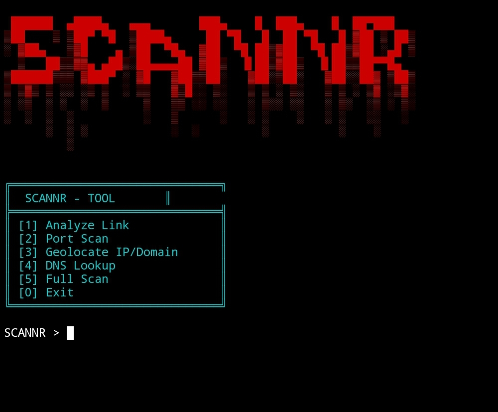

Here is a README.md file for your repository, written in English without emojis.

```markdown
# ScanNR - Security Scanner

ScanNR is a lightweight security scanner optimized for Termux environments. It provides URL analysis, port scanning, geolocation, DNS lookup, and a full scan mode.

## Features

- Link Analysis: Detect suspicious URLs, shorteners, and phishing patterns.
- Port Scanning: Scan common or custom ports on a target IP/domain.
- Geolocation: Retrieve country, city, ISP, and coordinates of an IP address.
- DNS Lookup: Resolve domain names to IP addresses and perform reverse lookups.
- Full Scan: Combine link analysis, port scan, and geolocation in one run.

## Requirements

- Python 3.6 or higher
- `requests` library
- `colorama` library

## Installation

1. Install the required Python packages:

```bash
pip install requests colorama
```

1. Download the script (scannr.py) to your device.
2. Make it executable (optional on Linux/Termux):

```bash
chmod +x scannr.py
```

Usage

Run the script with Python:

```bash
python scannr.py
```

Follow the interactive menu:

```
1. Analyze Link
2. Port Scan
3. Geolocate IP/Domain
4. DNS Lookup
5. Full Scan
0. Exit
```

Examples

· Analyze Link: Enter a full URL (e.g., https://example.com) to check for redirections, suspicious keywords, and URL shorteners.
· Port Scan: Provide a domain or IP address. Optionally specify custom ports (e.g., 80,443,8080).
· Geolocate: Enter an IP address or domain to get location and ISP data.
· DNS Lookup: Resolve a domain name to its IP address.
· Full Scan: Accepts a URL, domain, or IP. Runs link analysis (if URL), port scan, and geolocation.

Disclaimer

This tool is intended for educational and authorized security testing purposes only. Unauthorized scanning of networks or systems may violate laws and regulations. The author is not responsible for any misuse.


---
# Screenshots

